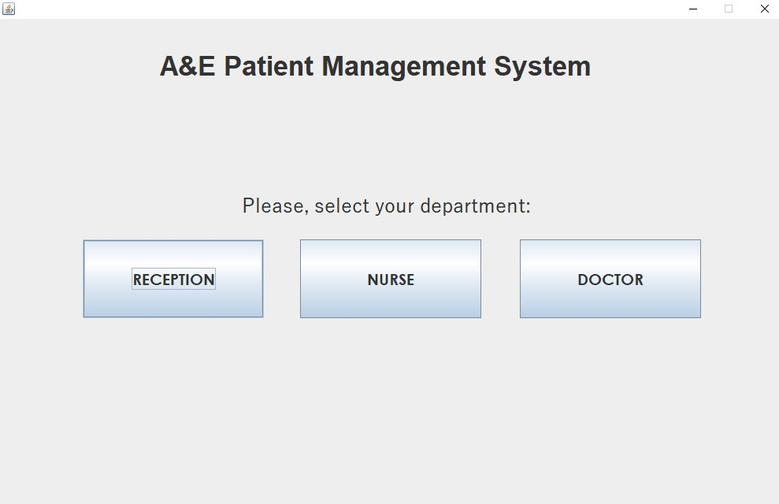
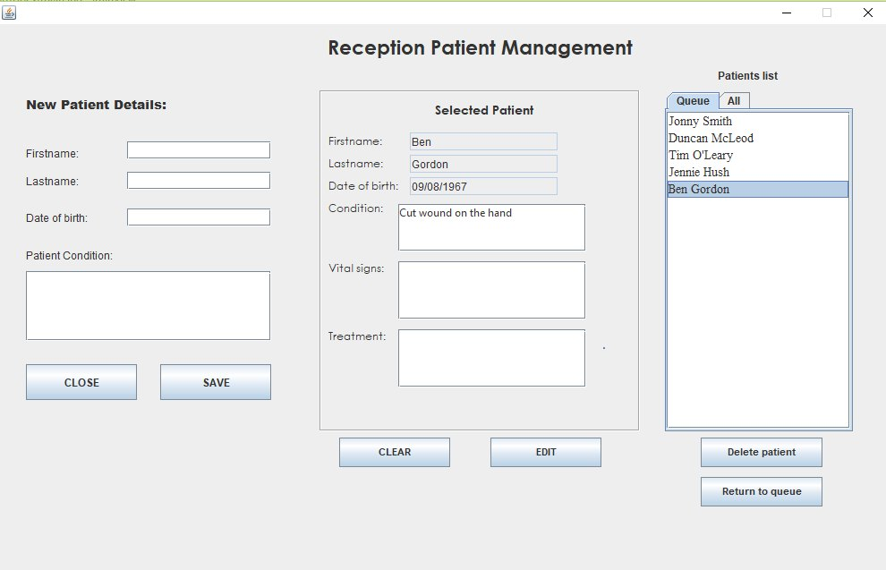
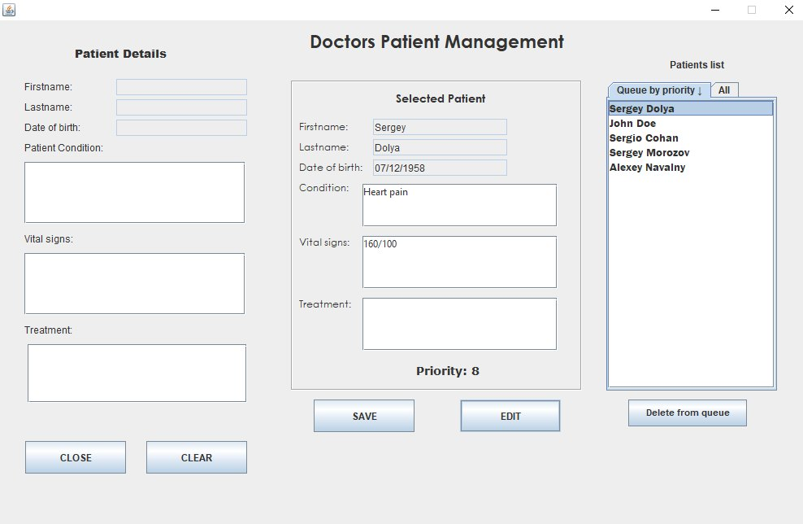

# Java-Patient-Management-System
University assignment: Patient Queue Management System
## Description
This project is about developing application in Java, using Eclipse and Swing framework.

A system for management of patients of accidents and emergency department is required by medical facility. 
The system developed according to given system requirement and provide functionality for receptionists, nurses and doctors.

Application follows good design principles and offers a data persistence for patients and patients’ transactions.

### System requirements
* There are 3 types of users for desired application: receptionists, nurses, doctors
* There are no appointments for patients, some queue algorithm should be developed for the application
* The patient initially registered by the receptionist, who takes his details and writes down patient condition
* After that, the nurse will see the patient, take his vital signs and assign a priority (1-10) to see the doctor for that patient.
* Finally, the patient will be called to doctor, who should leave a treatment notes in the system and after that, the patient will be removed from the queue.
* Offer data persistence for patient details
* GUI
* DoublyLinkedList for storing patients’ data

## Built using
* [Swing](https://en.wikipedia.org/wiki/Swing_(Java)) GUI Widget Toolkit
* [SQlite](http://www.sqlitetutorial.net/sqlite-java/sqlite-jdbc-driver/) database
* [Doubly Linked List](https://en.wikipedia.org/wiki/Doubly_linked_list) for patients queue

## Screenshots

")

## Overview
After starting application GUI.java main page with 3 buttons opens: Reception, Nurse and Doctor
1) Receptionist can create new patients, edit existing ones, and pull patients back to queue, it they came back after being discharged. Selecting the patient in the list, make his data appear in the **Selected Patient** pane, pressing EDIT button, will copy his details to the fields on the left for editing and saving.
Notes: as there are no priority assigned at this step, all patients priorities are automatically set as 0.
Patient data saves to **SQLite database** already on the first step, maximizing data persistence.

2) Nurse opens Nurse GUI to select patients from the queue and **assign a priority** to them.
After priority has been set, patient is deleted from the queue DLL(DoublyLinkedList) list, and added to another DLL, using method addSortedByPriority. So, in the second DLL, all patients are in sorted order.

3) Doctor adds treatment notes to patient and on pressing SAVE button, patient becomes discharged and removed from priority queue. They can be still seen in the All patients queue, which shows discharged patients.
The doctor GUI looks similar to Nurses one, except it doesn’t have **Select Queue Priority** checkbox.

## Pre-requisites
* [Java SDK](http://www.oracle.com/technetwork/java/javase/downloads/jdk8-downloads-2133151.html)
* [Eclipse IDE](http://www.eclipse.org/downloads/eclipse-packages/) / [NetBeans IDE](https://netbeans.org/features/index.html) or any other IDE for Java Development

## Installation
1. Download the project folder
2. Run **GUI.java** in your Java IDE
